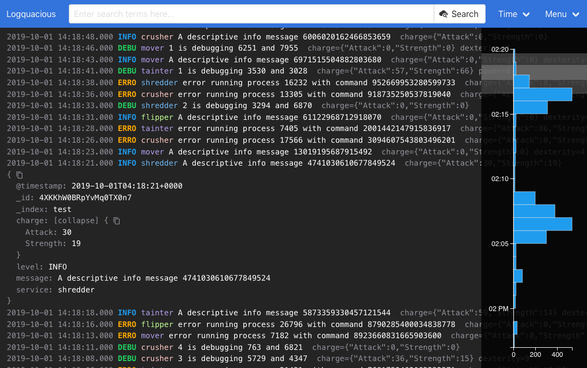

# Logquacious

Logquacious (lq) is a fast and simple log viewer built by Cash App. 

It currently only supports
exploration of logs stored in [ElasticSearch](https://www.elastic.co/products/elasticsearch),
however the storage/indexing backend is pluggable. If you are interested in
contributing more backends, open a pull request!



[More screenshots](./screenshots/README.md) that show off other parts of the UI.

## Rationale
Putting application and system logs in an ElasticSearch index is a common
way to store logs from multiple sources in a single place that can be searched.
However, while there are many web-based user interfaces for ElasticSearch, most
of them either focus on read/write access, treating ElasticSearch as a general
purpose database, or are ElasticSearch query builders. We didn't find any modern,
well-designed, minimalist web user interfaces designed with the explicit purpose
of read-only log exploration.

## Features

* Fields, filters and data sources are customisable, see [config.example.ts](config.example.ts).
* Interactive histogram.
* Time picker.
* URLs can be shared.
* Expandable log entries:
  * Multiple levels of JSON objects can be expanded.
  * Click on a value to add as a filter.
  * Can copy the whole JSON payload, or a single value by pressing the copy icon.
* Customise log direction.
* Customise light and dark theme.

## Planned Features

* Real time tailing.
* Show log context around an entry.

## Local demo

The local demo runs a basic web server which serves Logquacious.
It also runs an instance of ElasticSearch with a script to generate demo log entries.

You'll need docker and docker-compose installed, then run:
```
cd demo
docker-compose up
```

Wait a while, then visit http://localhost:2015/ in your browser.

You should be presented with the Logquacious UI and a few logs that are continuously generated in the background.

### Installation

#### Docker

*Coming soon*: publish image to Docker Hub.

You will need [Docker installed](https://www.docker.com/products/docker-desktop).

Build the image:
```shell script
docker build -f docker/Dockerfile -t logquacious .
```

You can configure the instance via command line arguments or environment variables (e.g. `ES_URL`):
```shell script
# docker run logquacious --help
Usage: lq-startup

Flags:
  --help                       Show context-sensitive help.
  --es-proxy                   Use a reverse proxy for ElasticSearch to avoid
                               needing CORS. (ES_PROXY)
  --es-url=STRING              ElasticSearch host to send queries to, e.g.:
                               http://my-es-server:9200/ (ES_URL)
  --es-index="*"               ElasticSearch index to search in. (ES_INDEX)
  --timestamp-field="@timestamp"
                               The field containing the main timestamp entry.
                               (TIMESTAMP_FIELD)
  --level-field="level"        The field containing the log level. (LEVEL_FIELD)
  --service-field="service"    The field containing the name of the service.
                               (SERVICE_FIELD)
  --message-field="message"    The field containing the main message of the log
                               entry. (MESSAGE_FIELD)
  --ignored-fields=_id,_index,...
                               Do not display these fields in the collapsed log
                               line. (IGNORED_FIELDS)
```

For example:
* ElasticSearch service is at `192.168.0.1`
* The ElasticSearch indexes start with `logs-`
* The message field is `text`
* You want the host to listen on port `8080` (internally it's always port `2015`).

```shell script
docker run -p 0.0.0.0:8080:2015 logquacious \
  --es-url="http://192.168.0.1:9200" \
  --es-index="logs-*" \
  --message-field="text"

2019/10/01 05:28:07 Variables for this docker image looks like this:
{ESProxy:true ESURL:http://192.168.0.1:9200 ESIndex:logs-* TimestampField:@timestamp LevelField:level ServiceField:service MessageField:text IgnoredFields:[_id _index] IgnoredFieldsJoined:}
2019/10/01 05:28:07 Successfully generated/lq/Caddyfile
2019/10/01 05:28:07 Successfully generated/lq/config.json
2019/10/01 05:28:07 Running caddy...
Activating privacy features... done.

Serving HTTP on port 2015
http://:2015
```

http://localhost:8080/ should work in this example.

#### From Source

* Install Node.js
```shell script
git clone https://github.com/square/logquacious
cd logquacious
npm install
npm run build
```
* `npm run build` will generate a `dist` directory containing all the files needed for a web server, including an `index.html` file.

Configure Logquacious in `config.ts`.

Setting up a web server if you don't already have one:

* Install Caddy: `curl https://getcaddy.com | bash -s personal`
* Create a `Caddyfile` to listen on port 2015 with http, also to talk to your ElasticSearch server:
```
:2015
proxy /es my-elastic-search-hostname:9200 {
  without /es
}
```
* Run `caddy` in the same directory as the `Caddyfile`
* Point your browser at `http://localhost:2015/`. The ElasticSearch endpoint should be working at `http://localhost:2015/es/`.

### Development

The development workflow is very similar to the "From Source" set up above. You can run a self reloading development server instead of `npm run build`.

You can either set up CORS on ElasticSearch or reverse proxy both the hot server and ElasticSearch. To do this, create `Caddyfile` in the root of the project:
```
:2015

# Redirect all /es requests to the ElasticSearch server
proxy /es my-elastic-search-hostname:9200 {
  without /es
}

# Redirect all other requests to parcel's development server.
proxy / localhost:1234
```

To run the parcel development server:
```
npm run hot
```

Run `caddy`. You should be able to hit http://localhost:2015/ and when you make any code changes the page should refresh.

There are tests which are executed with `npm test`.

### Configuration

The top level structure of the json configuration is as follows:
```json
{
  "dataSources": [],
  "fields": {
    "name-of-field-configuration": [],
  },
  "filters": []
}
```

#### dataSources

Contains the URL, index, etc for querying ElasticSearch. An example:

```json
"dataSources": [
  {
    "id": "elasticsearch-server",
    "type": "elasticsearch",
    "index": "{{.ESIndex}}",
    "urlPrefix": "{{if .ESProxy}}/es{{else}}{{.ESURL}}{{end}}",
    "fields": "main"
  }
]
```

`id` is a reference that can be used to create a data source filter. (See below). If you only have one data source, you don't need to create a data source filter.

`type` must be `elasticsearch` until more data sources are implemented.

`index` is the ElasticSearch index to search in. You can use an asterisk as a wildcard. This corresponds to the URL in a query request, e.g. `http://es:9200/index/_search`

`urlPrefix` is the URL to connect to your ElasticSearch server, without a trailing slash. This will resolve to `urlPrefix/index/_search`.

`fields` is a reference to the key of the `fields` in the top level of the json configuration.

#### fields

Configures how log entries are shown in the UI. You're able to transform, add classes, ignore fields, etc.

Here is an example:

```json
"fields": {
  "main": {
    "collapsedFormatting": [
      {
        "field": "@timestamp",
        "transforms": [
          "timestamp"
        ]
      },
      {
        "field": "message",
        "transforms": [
          {
            "addClass": "strong"
          }
        ]
      }
    ],
    "collapsedIgnore": ["_id", "_index"]
  }
}
```

This configuration will do the following:
* It is called `main` which is the `fields` reference used in `dataSources`.
* Place the `@timestamp` field at the start of each line and format it.
* Place the `message` field afterwards and make it stand out.
* All other fields in the log entry will be shown afterwards in the default grey colour, except `_id` and `_index`.

If you want to see an example of many transforms check out the [example config](./config.example.json).

#### filters

There is a menu drop down that is enabled when you use filters. It is between the search button and the time drop down.

You are able to customise it to have values you can filter on, e.g.:
```json
"filters": [
  {
    "id": "region",
    "urlKey": "r",
    "title": "Region",
    "default": "ap-southeast-2",
    "type": "singleValue",
    "items": [
      {
        "title": "All Regions",
        "id": null
      },
      {
        "title": "Sydney",
        "id": "ap-southeast-2"
      },
      {
        "title": "London",
        "id": "eu-west-2"
      }
    ]
  }
]
```

This `singleValue` filter allows you filter log entries based on `region` equalling `ap-southeast-2` for example. This is identical to searching for `region:ap-southeast-2` in the search field.

The `urlKey` is what is used in the URL for this filter. For example the URL might look like: `http://localhost:2015/?q=my+search&r=ap-southeast-2`

`title` is shown as the the name of the field/value in the search drop down menu.

The `null` value signifies that the filter was not selected, so it does not filter on that key in that case.

Another type of filter is a `dataSource` filter for when you have multiple ElasticSearch instances.
The `id` of each item must point to the `id` of a data source.
You can see an example of this in the [example config](./config.example.json) under the `env` filter.

### Cross-Origin Resource Sharing (CORS)

If you want to be able to communicate to ElasticSearch on a different host and port to Logquacious, you will need to
configure ElasticSearch to respond with the correct [CORS headers](https://developer.mozilla.org/en-US/docs/Web/HTTP/CORS).

For example, you are running https://lq.mycompany.com/ which serves the static content. You will need to set these configuration options in ElasticSearch:
```
http.cors.enabled: true
http.cors.allow-origin: "https://lq.mycompany.com/"
```

See the ElasticSearch documentation on the [http configuration options](https://www.elastic.co/guide/en/elasticsearch/reference/current/modules-http.html) for more information.

License
--------

    Copyright 2019 Square, Inc.

    Licensed under the Apache License, Version 2.0 (the "License");
    you may not use this file except in compliance with the License.
    You may obtain a copy of the License at

       http://www.apache.org/licenses/LICENSE-2.0

    Unless required by applicable law or agreed to in writing, software
    distributed under the License is distributed on an "AS IS" BASIS,
    WITHOUT WARRANTIES OR CONDITIONS OF ANY KIND, either express or implied.
    See the License for the specific language governing permissions and
    limitations under the License.
